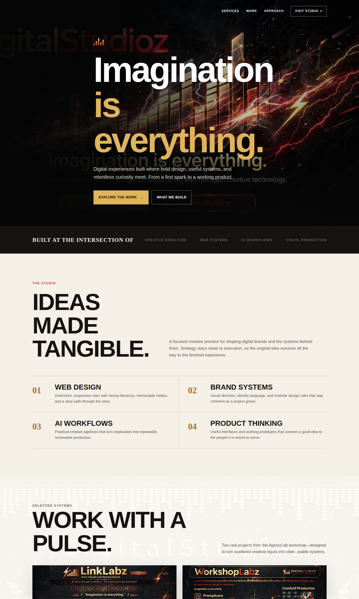

# DigitalStudioz Baseline Demo

> Trinity's winning entry in the DigitalStudioz Baseline bake-off — a cinematic charcoal/red/gold studio site built from the GetLayers "Baseline" template prompt.

[](https://agentzlab.github.io/DigitalStudioz-Baseline-Demo/)


**Live preview:** https://agentzlab.github.io/DigitalStudioz-Baseline-Demo/



## What's inside

- Cinematic dark hero with generated studio imagery — "Imagination is everything."
- Loader curtain + spring-reveal choreography (Baseline prompt patterns)
- Services section: Web Design, Brand Systems, AI Workflows, Product Thinking
- Project showcase featuring the real AgentzLab repos: **LinkLabz** and **WorkshopLabz**
- Stats band, sample-labeled testimonials, CTA + footer
- Generated imagery throughout — no placeholder boxes

## Design language

Charcoal `#111` grounds, signal red for energy, gold for premium accents. Display type over photographic plates, ghost numerals, generous whitespace. Dark-mode first.

## Tech stack

| Layer | Choice |
|---|---|
| Markup | Single self-contained `index.html` (exported from the Muse web artifact) |
| Styling | Inline CSS, custom properties |
| Motion | Vanilla JS spring/reveal helpers (Baseline-pattern) |
| Imagery | AI-generated plates, inlined |
| Hosting | GitHub Pages from `main` |

## Project structure

```
.
├── index.html            # the demo (self-contained)
├── assets/
│   └── screenshot.png    # dark-mode hero screenshot
├── .nojekyll
└── README.md
```

## Workflow

Changes on new branches only. No PRs unless Jon asks. Screenshots stay current after every build change.
